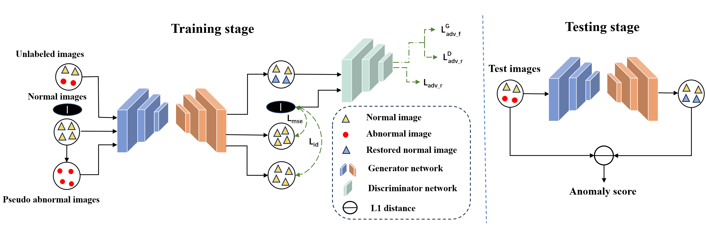
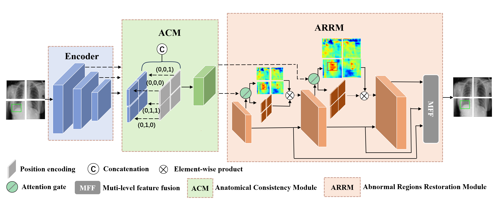

<p align="center">
  <h1 align="center">Spatial-aware Attention Generative Adversarial Network for Semi-supervised     
   Anomaly Detection in Medical Image</h1>
  <p align="center">
    ZeRui Zhang, ZhiChao Sun, ZeLong Liu, Bo Du, Zhou Zhao, YongChao Xu
  </p>
  <h3 align="center">Paper
  <h2 align="left">MICCAI 2024(Early Accept)</h2>
  <div align="center"></div>

</p>


  
<p align="center">
     <br>

<p align="center">
     <br>

## Install
1. Clone this repository and navigate to SAGAN folder

```bash
git clone https://github.com/zzr728/SAGAN.git
cd SAGAN
```

2. Install Package: Create conda environment

```Shell
conda create -n SAGAN python=3.9 -y
conda activate SAGAN
pip install --upgrade pip  # enable PEP 660 support
```

3. Install additional packages for training cases
```Shell
pip install -r requirements.txt
```

## Data Preparation
Download the well-processed Med-AD benchmark from: [Google Drive](https://drive.google.com/file/d/1ijdaVBNdkYP4h0ClYFYTq9fN1eHoOSa6/view?usp=sharing) | [OneDrive](https://hkustconnect-my.sharepoint.com/:u:/g/personal/ycaibt_connect_ust_hk/EdCbKrjjRMlKi-1AotcAfkoB_jmbTQ2gnQChltgh7l8xVQ?e=t17t2S). <br>
(RSNA, VinDr-CXR and LAG are one of the benchmarks, and should be **only applied for academic research**.)

## Training
```bash
bash train.sh
```

## Evalution
```bash
bash test.sh
```

## Pretraining Model Download
This repository provides pre-trained SAGAN model checkpoints that can be downloaded and used for medical anomaly detection tasks.The available pre-trained models include:

 Model Descriptions | Model Weights | 
|--- | --- |
| SAGAN RSNA-finetuned | [SAGAN_G_RSNA.ckpt](https://drive.google.com/file/d/1AwFg6qEJVT2exmyWStvk32sEmboYjcth/view?usp=drive_link) 
| SAGAN VinDr-CXR-finetuned | [SAGAN_G_VinDr-CXR.ckpt](https://drive.google.com/file/d/1qqAa8TdrFRIgwzn6oTsDRhOMEswNCede/view?usp=drive_link) 
| SAGAN LAG-finetuned | [SAGAN_G_LAG.ckpt](https://drive.google.com/file/d/15P7zu_I4oZluDIgjqgSNuDajqAfFzhxk/view?usp=drive_link) 
